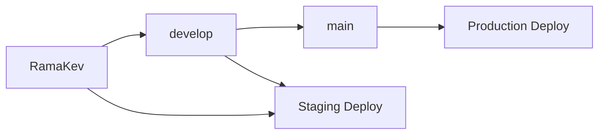

# 🚀 CI/CD Setup - Paradise Dance Academy

## 📋 Índice
1. [Configuración Inicial](#configuración-inicial)
2. [Secrets de GitHub](#secrets-de-github)
3. [Flujo de Trabajo](#flujo-de-trabajo)
4. [Comandos Útiles](#comandos-útiles)
5. [Monitoreo y Logs](#monitoreo-y-logs)
6. [Troubleshooting](#troubleshooting)

## 🛠️ Configuración Inicial

### Prerrequisitos
- ✅ Repositorio en GitHub
- ✅ Cuenta en Vercel
- ✅ Proyecto configurado con Next.js
- ✅ Base de datos configurada

### 1. Conectar GitHub con Vercel

```bash
# Instalar Vercel CLI
npm install -g vercel

# Login en Vercel
vercel login

# Conectar proyecto
vercel link
```

### 2. Obtener IDs de Vercel

```bash
# Obtener ORG ID y PROJECT ID
vercel env ls
```

## 🔐 Secrets de GitHub

Ve a tu repositorio → **Settings** → **Secrets and variables** → **Actions**

### Secrets Requeridos:

| Secret | Descripción | Dónde obtenerlo |
|--------|-------------|-----------------|
| `VERCEL_TOKEN` | Token de acceso de Vercel | [vercel.com/account/tokens](https://vercel.com/account/tokens) |
| `VERCEL_ORG_ID` | ID de tu organización | `vercel project ls` |
| `VERCEL_PROJECT_ID` | ID del proyecto | `vercel project ls` |

### Configurar Secrets:

```bash
# 1. Crear token en Vercel
# 2. Copiar el token
# 3. En GitHub: Settings > Secrets > New repository secret
# 4. Nombre: VERCEL_TOKEN, Valor: tu_token_aquí
```

## 🔄 Flujo de Trabajo

### Branches y Deployments



### Proceso Automático

1. **Push a cualquier branch** → Tests + Linting
2. **Push a `develop`/`RamaKev`** → Deploy a Staging
3. **Push a `main`** → Deploy a Production

### Manual Override

```bash
# Deploy manual a staging
npm run vercel:preview

# Deploy manual a production
npm run vercel:deploy
```

## 🚀 Pipeline Stages

### 1. **Lint & Type Check** (2-3 min)
- ESLint verification
- TypeScript type checking
- Code style validation

### 2. **Testing** (3-5 min)
- Unit tests with Jest
- Coverage reports
- Multiple Node.js versions

### 3. **Build** (5-8 min)
- Next.js build
- Prisma client generation
- Bundle size analysis

### 4. **Security** (1-2 min)
- Dependency vulnerability scan
- License compliance check
- Security audit

### 5. **Deploy** (2-4 min)
- Vercel deployment
- Environment configuration
- Health checks

## 📊 Comandos Útiles

### Desarrollo Local
```bash
# Verificar antes del commit
npm run lint
npm run type-check
npm test
npm run build

# Simular CI localmente
npm run test:ci
npm run build
```

### Monitoreo
```bash
# Ver status de deployment
vercel ls

# Ver logs en tiempo real
vercel logs [deployment-url]

# Inspeccionar build
vercel inspect [deployment-url]
```

### Debug
```bash
# Verificar configuración
vercel env ls

# Probar deployment local
vercel dev

# Build con debug
DEBUG=1 npm run build
```

## 📈 Monitoreo y Logs

### GitHub Actions
- Ve a tu repo → **Actions** tab
- Click en cualquier workflow run
- Revisa logs por job

### Vercel Dashboard
- [vercel.com/dashboard](https://vercel.com/dashboard)
- Click en tu proyecto
- Tab **Functions** para logs de API
- Tab **Analytics** para métricas

### Alertas Automáticas
```yaml
# En .github/workflows/main.yml
# Las fallas envían notificaciones automáticamente
```

## 🔧 Troubleshooting

### Problemas Comunes

#### 1. **Build Falla**
```bash
# Error: Prisma client not generated
# Solución: Verificar que db:generate esté en pipeline
npm run db:generate
npm run build
```

#### 2. **Tests Fallan en CI**
```bash
# Error: Tests pass locally but fail in CI
# Solución: Usar flag --watchAll=false
npm run test:ci
```

#### 3. **Deploy Rechazado**
```bash
# Error: Vercel deployment failed
# Verificar secrets:
vercel env ls
```

#### 4. **Timeout en Pipeline**
```bash
# Si el pipeline se cuelga:
# 1. Revisar dependency installation
# 2. Verificar tests infinitos
# 3. Reducir matrix de Node.js versions
```

### Debug Avanzado

#### Verificar Environment Variables
```bash
# Local
cat .env.local

# Vercel
vercel env ls

# GitHub
# Settings > Secrets > Actions
```

#### Test Pipeline Localmente
```bash
# Simular CI environment
CI=true npm run test:ci
NODE_ENV=production npm run build
```

## 🎯 Best Practices

### 1. **Commits**
```bash
# Commits descriptivos
git commit -m "feat: add payment system validation"
git commit -m "fix: resolve authentication middleware bug"
git commit -m "test: add unit tests for user service"
```

### 2. **Branch Protection**
- Requiere status checks
- Requiere reviews para main
- No permite force push a main

### 3. **Environment Management**
```bash
# Development
.env.local

# Staging
Vercel Preview environment

# Production  
Vercel Production environment
```

### 4. **Monitoring**
- Set up Vercel Analytics
- Monitor Core Web Vitals
- Track deployment frequency

## 🚀 Comandos Rápidos

```bash
# Quick deploy to staging
git push origin RamaKev

# Quick deploy to production
git checkout main
git merge develop
git push origin main

# Emergency rollback
vercel rollback [deployment-url]

# Check pipeline status
gh run list --limit 5
```

## 📱 Notificaciones

### Slack/Discord Integration
```yaml
# Agregar al workflow:
- name: Notify Success
  if: success()
  run: |
    curl -X POST -H 'Content-type: application/json' \
    --data '{"text":"✅ Paradise Dance Academy deployed successfully!"}' \
    ${{ secrets.SLACK_WEBHOOK_URL }}
```

## 🔄 Actualizaciones

Para actualizar el pipeline:

1. **Modifica** `.github/workflows/main.yml`
2. **Commit** los cambios
3. **Push** para activar nueva versión
4. **Monitorea** el primer run

---

## 🆘 Soporte

Si tienes problemas:

1. **Revisa logs** en GitHub Actions
2. **Verifica secrets** están configurados
3. **Consulta** [Vercel Docs](https://vercel.com/docs)
4. **Checa** [GitHub Actions Docs](https://docs.github.com/en/actions)

**¡Tu CI/CD está listo! 🎉** 